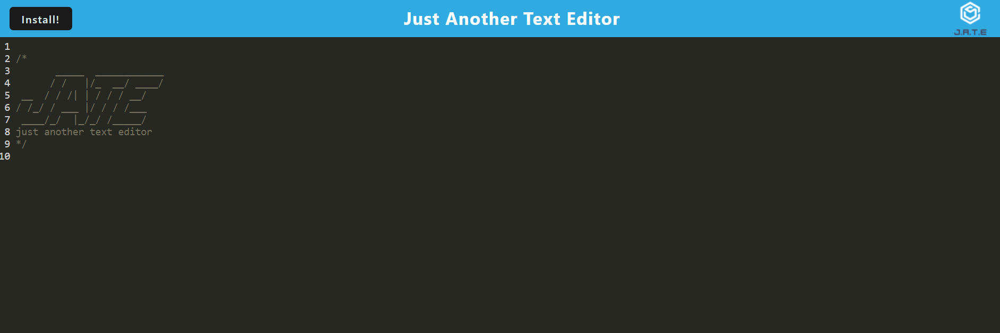

# PWA Text-Editor

In this project, I was approached to apply the finishing touches to some starter code that was provided to me in order to build a PWA text-editor.

To achieve this, I needed to use a lot of new tech such service workers, IndexedDB, Concurrently and Webpacks. As it is a PWA it can be installed and used offline.

## Table of Contents

[Installation](#installation)

[Usage](#usage)

[Contributing](#contributing)

[License](#license)

[Questions](#questions)

[Links](#links)

## Installation

To install this you will need to run: 'npm i'.

## Usage

To start you will need to run 'npm start:dev' which uses concurrently to start up the backend and serve the client

## Contributing

To contribute to this, clone the repo locally and commit on a seperate branch.

## License

This application is covered under the following license: The Unlicence

## Links

I have deployed this application to heroku which can be viewed by [clicking here](https://damp-beach-90625.herokuapp.com/)